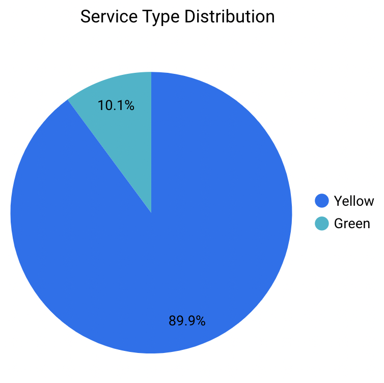
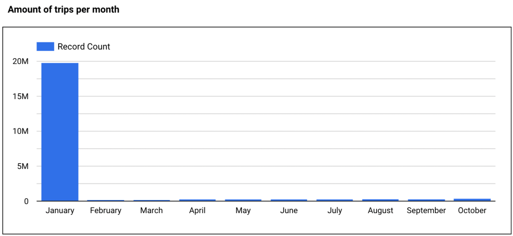

## Week 4 Homework

### Question 1

**What is the count of records in the model fact_trips after running all models with the test run variable disabled and filtering for 2019 and 2020 data only (pickup datetime)?**

You'll need to have completed the ["Build the first dbt models"](https://www.youtube.com/watch?v=UVI30Vxzd6c) video and have been able to run the models via the CLI.
You should find the views and models for querying in your DWH.

```sql
SELECT
    count(*) 
FROM
    `rational-oasis-375505.dbt_sandbox.fact_trips` 
WHERE
    pickup_datetime >= '2019-01-01 00:00:00' AND
    pickup_datetime <= "2020-12-31 23:59:59"
```

- 41648442
- 51648442
- **Answer: 61648442**
- 71648442

### Question 2

**What is the distribution between service type filtering by years 2019 and 2020 data as done in the videos?**

You will need to complete "Visualising the data" videos, either using [google data studio](https://www.youtube.com/watch?v=39nLTs74A3E) or [metabase](https://www.youtube.com/watch?v=BnLkrA7a6gM).

<!--  -->


- **Answer: 89.9/10.1**
- 94/6
- 76.3/23.7
- 99.1/0.9

### Question 3

**What is the count of records in the model stg_fhv_tripdata after running all models with the test run variable disabled (:false)?**  

Create a staging model for the fhv data for 2019 and do not add a deduplication step. Run it via the CLI without limits (is_test_run: false).
Filter records with pickup time in year 2019.

```sql
{{ config(materialized='view') }}

select
    -- identifiers
    dispatching_base_num,
    Affiliated_base_number,
    cast(pulocationid as integer) as  pickup_locationid,
    cast(dolocationid as integer) as dropoff_locationid,
    
    -- timestamps
    cast(pickup_datetime as timestamp) as pickup_datetime,
    cast(dropoff_datetime as timestamp) as dropoff_datetime,
    
    -- trip info
    cast(SR_Flag as integer) as sr_flag
    
from {{ source('staging','fhv_tripdata') }}
where pickup_datetime >= "2019-01-01 00:00:00" AND pickup_datetime <= "2029-12-31 23:59:59"
```

- 33244696
- **Answer: 43244696**
- 53244696
- 63244696

### Question 4

**What is the count of records in the model fact_fhv_trips after running all dependencies with the test run variable disabled (:false)?**  

Create a core model for the stg_fhv_tripdata joining with dim_zones.
Similar to what we've done in fact_trips, keep only records with known pickup and dropoff locations entries for pickup and dropoff locations.
Run it via the CLI without limits (is_test_run: false) and filter records with pickup time in year 2019.

```sql
{{ config(materialized='table') }}

with fhv_data as (
    select *, 
        'FHV' as service_type 
    from {{ ref('stg_fhv_tripdata') }}
), 

dim_zones as (
    select * from {{ ref('dim_zones') }}
    where borough != 'Unknown'
)
select 
    fhv_data.pickup_locationid, 
    pickup_zone.borough as pickup_borough, 
    pickup_zone.zone as pickup_zone, 
    fhv_data.dropoff_locationid,
    dropoff_zone.borough as dropoff_borough, 
    dropoff_zone.zone as dropoff_zone,  
    fhv_data.pickup_datetime, 
    fhv_data.dropoff_datetime,
    fhv_data.dispatching_base_num,
    fhv_data.SR_Flag,
    fhv_data.Affiliated_base_number
from fhv_data
inner join dim_zones as pickup_zone
on fhv_data.pickup_locationid = pickup_zone.locationid
inner join dim_zones as dropoff_zone
on fhv_data.dropoff_locationid = dropoff_zone.locationid
where pickup_datetime >= "2019-01-01 00:00:00" AND pickup_datetime <= "2029-12-31 23:59:59"
```

- 12998722
- **Answer: 22998722**
- 32998722
- 42998722

### Question 5

**What is the month with the biggest amount of rides after building a tile for the fact_fhv_trips table?**

Create a dashboard with some tiles that you find interesting to explore the data. One tile should show the amount of trips per month, as done in the videos for fact_trips, based on the fact_fhv_trips table.



- March
- April
- **Answer: January**
- December
